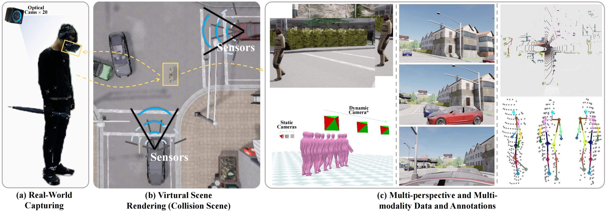

# Decoupling Human and Camera Motion from Videos in the Wild

Official code respository for the paper "Pedestrian Motion Reconstruction: A Large-scale Benchmark via Mixed Reality Rendering with Multiple Perspectives and Modalities".

PMR dataset is a large-scale, comprehensive dataset derived from an innovative mixed reality platform that includes third-person perspective RGB videos from moving vehicles, LiDAR data from vehicles, and the egocentric perspective of pedestrians.

[[Project page]]() | [Dataset](https://pan.baidu.com/s/1ih57araefW_cb_D8H8WhOg?pwd=cc1t) Extracted Code:cc1t

**You can view the sampled sequence in the mini-version folder without download the large .zip files**

## Overview


## Visualization Example


## Dataset License/Download

## Dataset Information
PMR features a vast collection of data from 54 subjects interacting across 13 urban 
settings with 7 objects, encompassing 12,138 sequences with diverse weather
conditions and vehicle speeds. Please find more detailed statistics in our paper.

|frames              |     train    |     val    |    test   |    total   |   
|--------------------|:------------:|:----------:|:---------:|:----------:|
| Third_view         |   948545     |   271013    |   135506   |   1355064  |
| Ego_view           |     158091   |   45169     |    22584   |   225844   |
* `Third_view`: Synchronized frames of pedetrians captured from viechles with various speeds and perspectives in the Carla simulator.
* `Ego_view`: Egocentric frames captured from the pedetrians' perspective, which is also synchronized with the Third_view frames and all kinds of annotations.

## Dataset Documentation
### Info files
### Third-person view data streams
```
PMR
├── output_$date$
│    ├── id$id$_m$mode$_w$weather$_s$scene$
│    │   ├── view$view$
│    │   │   ├── xxxxx.jpg
│    │   │   ├── ...
│    │   ├── ...
│    ├── ...
```
* `$date$`: Third-person view frames captured on `$date$`.
* `$id$`: Third-person frames captured from subject `$id$`.
* `$mode$`: Different veichle modes under a specific `$scene$`.
* `$view$`:  
* `xxxxx.jpg`: frame for timestamp `xxxxx`, which is synchronized with the egocentric frames and annotations.
### Egocentric view data streams
```
PMR
├── egoviews_aligned    
│    ├── output_$date$
│    │   ├── id$id$_m$mode$_w$weather$_s$scene$
│    │   │   ├── xxxxx.jpg
│    │   │   ├── ...
│    │   ├── ...
│    ├── ...
```
* egocentric RGB frames enjoys the same structure (except the inner `$file$` subforder since we record each sequence with muliple perspectives for third-person view while single for egocentric view) and timestamp as the third-person view frames under.
### Annotation files
```
PMR
├── annots    
│    ├── output_$date$
│    │   ├── id$id$_m$mode$_w$weather$_s$scene$.pkl
│    │   ├── ...
│    ├── ...
```
We reorganize all annotations for one sequence into a single pickle file. The file naming methods is consistent to the third-person view frames and egocentric view frames, and has an inner architecture as following:
```
id$id$_m$mode$_w$weather$_s$scene$.pkl
├── annots    
│    ├── cam_extrinsics
│    │   ├── view1
│    │   ├── view1_side
│    │   ├── ...(view$view$)
│    ├── lidar
│    │   ├── lidar1
│    │   │    ├── lidar_extrinsics
│    │   │    ├── ped_lidar_points
│    │   │    ├── semantic_lidar_points
│    │   ├── lidar2
│    │   │    ├── lidar_extrinsics
│    │   │    ├── ped_lidar_points
│    │   │    ├── semantic_lidar_points
│    ├── smplx
│    ├── timestamp
│    ├── kpts3d
│    ├── instrinsics
│ ....
```
##  Visualization Code
### Getting started
This code was tested on Ubuntu 22.04 LTS and requires a CUDA-capable GPU.

1. Clone repository and submodules
    <!-- ```
    git clone --recursive https://github.com/vye16/slahmr.git
    ```
    or initialize submodules if already cloned
    ```
    git submodule update --init --recursive
    ``` -->

2. Set up conda environment. Run 
    ```
    source install.sh
    ```

3. Download models from [here](https://drive.google.com/file/d/1GXAd-45GzGYNENKgQxFQ4PHrBp8wDRlW/view?usp=sharing). Run
    ```
    ./download_models.sh
    ```
    or
    ```
    gdown https://drive.google.com/uc?id=1GXAd-45GzGYNENKgQxFQ4PHrBp8wDRlW
    unzip -q slahmr_dependencies.zip
    rm slahmr_dependencies.zip
    ```

    All models and checkpoints should have been unpacked in `_DATA`.


### Visualizing human mesh, lidar points, and skeletons:
For visualizing a specific sequence, you can edit the config file: `confs/data/carla.yaml`.
Then, from the current directory, you can run:
```
python main.py data=carla run_vis=True
```

We use hydra to launch experiments, and all parameters can be found in `confs/config.yaml`.
If you would like to update any aspect of logging or visualization tuning, update the relevant config files.

By default, we will log each run to `outputs/video-val/<DATE>/<VIDEO_NAME>`.
Each stage of optimization will produce a separate subdirectory, each of which will contain outputs saved throughout the optimization
and rendered videos of the final result for that stage of optimization.

### Visualizing stereo semantic lidar:
To visualizing semantic lidar, you need to install pyrender correctly, and run:
```
python semantic_vis.py --annots <annots_path> --lidar_no <lidar_no>
```

<!-- ## BibTeX

If you use our code in your research, please cite the following paper:
<!-- ```
@inproceedings{ye2023slahmr,
    title={Decoupling Human and Camera Motion from Videos in the Wild},
    author={Ye, Vickie and Pavlakos, Georgios and Malik, Jitendra and Kanazawa, Angjoo},
    booktitle={IEEE Conference on Computer Vision and Pattern Recognition (CVPR)},
    month={June},
    year={2023}
} --> -->
